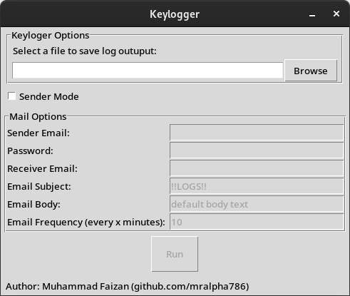

# Keylogger




This is a simple implementation of a keylogger. It can log keys in the background and send the logs to email as an attachment.


## Requirements
* Python 3.x


## Installation
1. Clone this repo
```bash
git clone https://github.com/MrAlpha786/Keylogger; cd Keylogger
```


2. Install requirements
```bash
pip3 install -r requirements.txt
```
**Note:** It is advisable that you create a virtual environment to protect your system from unneeded packages.


3. Edit the ``config.py`` file (GUI version don't require this step).


**Note:** You can write sensitive information like, sender email, password, and receiver email in a secret file. Just leave these fields empty in ``config.py`` and create a file called ``secret.txt``. Check ``secret_template.txt``.


4. Now you can run either the ``gui.py`` or ``app.py``
```bash
python3 gui.py
```
or
```bash
python3 app.py
```


5. **Extra step:** you can create a standalone executable using a package like **pyinstaller**.
```bash
pip3 install pyinstaller
pyinstaller --onefile -w gui.py
```

## Troubleshoot
1. **ModuleNotFoundError: No module named ‘tkinter’**
    * **On Linux:**\
    Install tkinter package.
    ```bash
    sudo apt install python3-tk 
    ```

    * **On Windows:**\
        You can install tkinter module when installing python on Windows. Click on Custom, in the installer and tick the tkinter option.

**Note:** Create an issue, if your problem is not listed above.
